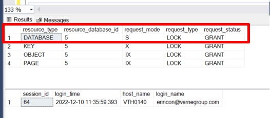
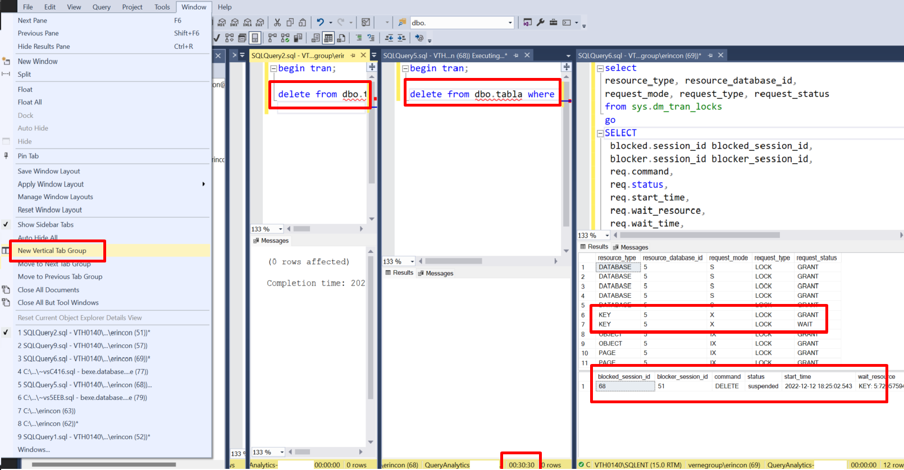

- [Introducción](#introducción)
- [Base teórica](#base-teórica)
- [DMVs necesarias](#dmvs-necesarias)
- [Conclusión y siguientes pasos](#conclusión-y-siguientes-pasos)

# Introducción


>Los bloqueos son malos. Llegan cuando menos te los esperas, y cuando los estás esperando, no aparecen. Tiene algo de gato y ratón.

Hay herramientas de sobra para perseguirlos; con un método consistente, seguramente les des caza. El trabajo del DBA es localizarlos, crear las evidencias necesarias, y plantear soluciones.

En este "artículo" te muestro fundamentos para hacer los primeros diagnósticos. Hay mucha documentación y ejemplos para analizarlos; el objetivo es que te pueda servir como guía de aprendizaje para poco a poco sentirte cómogo analizando bloqueos. Sigue los enlaces que comparto porque se necesitan como "guia de estudio".


# Base teórica

>Es difícil participar en un triatlón si no sabes andar en bicicleta. 

De igual manera, para entender cómo funcionan los bloqueos en SQL Server, necesitas una base teórica. Conceptualmente es sencillo: los SSGG de BBDD están diseñados para atender peticiones de muchos usuarios. Si dos consultas, necesitan cambiar registros, el motor debe garantizar que se cumpla el ACID Test. En relación a transacciones, implementa un "control de concurrencia" para garantizar la I de Isolation (Aislamiento).


En [este enlace](https://learn.microsoft.com/en-us/sql/relational-databases/sql-server-transaction-locking-and-row-versioning-guide?source=recommendations&view=sql-server-ver16) tienes toda la base teórica necesaria para comprender los niveles de aislamiento en SQL Server. No es necesario que te estudies el contenido completo (poco a poco); empieza por estas secciones:

- [Transaction basics](https://learn.microsoft.com/en-us/sql/relational-databases/sql-server-transaction-locking-and-row-versioning-guide?source=recommendations&view=sql-server-ver16#Basics): conceptos básicos, ACID, transacciones implícitas y explícitas, contexto, inicio y confirmación (BEGIN/COMMIT TRAN).
  
- [Locking and row versioning basics](https://learn.microsoft.com/en-us/sql/relational-databases/sql-server-transaction-locking-and-row-versioning-guide?source=recommendations&view=sql-server-ver16#Lock_Basics): cómo se adquieren bloqueos (locks), y efectos de la concurrencia (lecturas sucias, no repetibles, perdida de inserciones, etc.). La segunda parte toca los niveles de aislamiento, y sus efectos en la concurrencia (por ejemplo, qué nivel de aislamiento elegir para que el dato leído en una transacción sea inmutable).
  
- [Locking in the Database Engine](https://learn.microsoft.com/en-us/sql/relational-databases/sql-server-transaction-locking-and-row-versioning-guide?source=recommendations&view=sql-server-ver16#Lock_Engine): cómo implementa SQL Server los puntos anteriores, es decir, qué tipo de recursos puede bloquear el motor (registro, página, objeto, base de datos) y tipos de bloqueos (compartidos, no compartidos, exclusivos, …).
  
- [Lock compatibility](https://learn.microsoft.com/en-us/sql/relational-databases/sql-server-transaction-locking-and-row-versioning-guide?source=recommendations&view=sql-server-ver16#lock_compatibility): donde se explica la compatibilidad de bloqueos; por ejemplo, dos conexiones no puede tener asignado bloqueo exclusivo (X) sobre un recurso.

Esas secciones son fundamentales si necesitas entender situaciones de bloqueos. Responde al siguiente ejercicio para ver cómo estas:

Dada una tabla como esta:

```console
create table dbo.tabla ( 
id int identity primary key,
relleno char(100) not null
);
insert into dbo.tabla (relleno)
select name
from sys.all_objects;
```

Ejecutando un borrado como este:

```begin tran;
delete from dbo.tabla
where id = 1;
```
¿Por qué aparece en esta query un bloqueo a nivel de DATABASE:

```
select 
resource_type, resource_database_id, 
request_mode, request_type, request_status
from sys.dm_tran_locks
where request_session_id = 64; -- CAMBIA POR TU SESSION_ID
```



La respuesta está en [DATABASE como resource type](/ej01-DATABASE-como-resource_type.md)

# DMVs necesarias

Estas son las DMVs que necesitas para analizar cuestiones de bloqueos:
- [sys.dm_tran_locks](https://learn.microsoft.com/en-us/sql/relational-databases/system-dynamic-management-views/sys-dm-tran-locks-transact-sql?view=sql-server-ver16): Información de bloqueos adquiridos por las conexiones. Revisa el enlace para entender lo que informa cada columna. Con el tiempo añadirás columnas a tu arsenal, pero para empezar te servirán: resource_type, resource_database_id, request_mode, request_type, request_status, y request_session_id.
- [sys.dm_exec_sessions](https://learn.microsoft.com/es-es/sql/relational-databases/system-dynamic-management-views/sys-dm-exec-sessions-transact-sql?view=sql-server-ver16): Información de las conexiones. Quédate con esta relación de tablas:

- [sys.dm_exec_requests](https://learn.microsoft.com/en-us/sql/relational-databases/system-dynamic-management-views/sys-dm-exec-requests-transact-sql?view=sql-server-ver16): Información de cada petición que está procesando SQL Server. la columna session_id, se enlaza con request_session_id si hay bloqueos. Columnas de interés: session_id, start_time, status, command, blocking_session_id, database_id, wait_type, wait_time, wait_resource, sql_handle, y plan_handle.
- [sys.dm_exec_connections](https://learn.microsoft.com/es-es/sql/relational-databases/system-dynamic-management-views/sys-dm-exec-connections-transact-sql?view=sql-server-ver16): Información de las conexiones abiertas en la instancia de SQL Server. Columnas como session_id, num_read, num_writes, most_recent_sql_handle. Enlaza con sys.dm_exec_requests por la columna session_id.
- [sys.dm_exec_sql_text](https://learn.microsoft.com/en-us/sql/relational-databases/system-dynamic-management-views/sys-dm-exec-sql-text-transact-sql?view=sql-server-ver16): Función que devuelve la instrucción SQL para un sql_handle (relacionado con la DMV anterior).

Este JOIN de DMVs te servirá en tus análisis:

```
SELECT 
 blocked.session_id blocked_session_id, 
 blocker.session_id blocker_session_id, 
 req.command,
 req.status, 
 req.start_time,
 req.wait_resource,
 req.wait_time,
 req.wait_resource,
 sql_blocker.text blocker_query_text,
 sql_blocked.text blocked_query_text
FROM    sys.dm_exec_requests req
JOIN    sys.dm_exec_sessions blocked
ON      req.session_id = blocked.session_id
JOIN    sys.dm_exec_sessions blocker
ON      req.blocking_session_id = blocker.session_id
OUTER APPLY sys.dm_exec_sql_text(req.sql_handle) sql_blocked
JOIN    sys.dm_exec_connections c
ON      blocker.session_id = c.session_id
OUTER APPLY sys.dm_exec_sql_text(c.most_recent_sql_handle) sql_blocker
```
Donde para una situación de bloqueos, podríamos tener este resultado:


Que muestra esta situación:

- A la sesión 52, la bloquea la sesión 69.
- A la sesión 69, la bloquea la sesión 67.
- A la sesión 77, la bloquea la sesión 52.

Que sería lo mismo que decir, si la sesión 67 no bloqueara a la 69, la 69 no bloquearía a la 52, que a su vez no bloquearía a la sesión 77.

Revisando los query text, tendríamos que:

- la instrucción: DELETE from dbo.tabla where id = 1;
- no permite ejecutar la instrucción: (@1 tinyint)DELETE [dbo].[tabla] WHERE [id]=@1,
que a su vez no permite ejecutar la instrucción: (@1 tinyint)UPDATE [dbo].[tabla] set [relleno] = NULL WHERE [id]=@1,
- que a su vez no permite ejecutar la instrucción: TRUNCATE table dbo.tabla.

Podemos decir que hemos diagnosticado la situación de bloqueo, pero no tenemos solución; sólo queda esperar... 
Si dos conexiones, intentan borrar la misma fila (como es el caso que he simulado), toca esperar a que la primera conexión que tomó el bloqueo exclusivo (columna wait_resource) sobre el registro (el blocker_session_id = 67) complete lo que está haciendo. Cuando vaya la segunda conexión, la lógica de la aplicación que hizo la llamada debería estar preparada para el intento de borrado de una fila que borró la conexión anterior. 

> Nota: para el contexto de este artículo introductorio, quizás es avanzado, pero ten en cuenta que hay ORMs y aplicaciones que verifican que al borrar un registro, si el registro no se ha borrado, se genere una excepción. Mira este [enlace](https://groups.google.com/g/sqlalchemy/c/-uMK7x4Wg0I?pli=1).

Para completar lo anterior, el trabajo de análisis es un poco más complicado, porque como DBA tras diagnosticar, hay que intentar mejorar. La situación anterior, quizás necesite incluso que revises el plan de ejecución de las consultas para ver si los índices se pueden utilizar de una forma más eficiente. Este tema se trata en [este artículo](/Indexacion/05-Indexacion-y-bloqueos.md).  

# Conclusión y siguientes pasos

Tienes que perderle el miedo a los bloqueos. Lo conseguirás con muchas pruebas. No hay atajos.

Sería bueno que juegues en setup local de SQL Server con Management Studio y dos conexiones bloqueandose una a otra. Deja abiertas transacciones, comprueba con las consultas de DMVs de arriba qué hay bloqueado. Lanza consultas que se queden esperando; no la canceles, utiliza la DMV en otra ventana de SSMS y comprueba los bloqueos.

Utiliza la opción de abrir ventanas de consultas el vertical (ver imagen). 
No te asustes por tener conexiones esperando (fijate abajo 30 minutos).

Hace mucho tiempo, cuando empecé como tú, dejar conexiones abiertas en tu entorno de lab para hacer pruebas, dejaba sensación parecida a Neo en Matrix... parabas el tiempo, y analizabas. Cuando tengas esa sensación, te empezarán a gustar los bloqueos 😉





Query para buscar bloqueos:
- bloqueador, y bloqueado.
- propiedades de la conexión: usuario, aplicacion, ...
- TSQL bloqueada, y bloqueadora


```

 SELECT  @ts,
                    blocker.session_id blocker_session_id,
                    blocked.session_id blocked_session_id,
                    blocker.database_id blocker_database_id,
                    blocked.database_id blocked_database_id,
                    blocker.login_name blocker_login_name,
                    blocked.login_name blocked_login_name,
                    CASE blocker.transaction_isolation_level
                      WHEN 0 THEN 'Unspecified'
                      WHEN 1 THEN 'ReadUncomitted'
                      WHEN 2 THEN 'ReadCommitted'
                      WHEN 3 THEN 'Repeatable'
                      WHEN 4 THEN 'Serializable'
                      WHEN 5 THEN 'Snapshot'
                    END blocker_transaction_isolation_level,
                    CASE blocked.transaction_isolation_level
                      WHEN 0 THEN 'Unspecified'
                      WHEN 1 THEN 'ReadUncomitted'
                      WHEN 2 THEN 'ReadCommitted'
                      WHEN 3 THEN 'Repeatable'
                      WHEN 4 THEN 'Serializable'
                      WHEN 5 THEN 'Snapshot'
                    END blocked_transaction_isolation_level,
                    blocker.open_transaction_count blocker_open_transaction_count,
                    blocked.open_transaction_count blocked_open_transaction_count,
                    sql_blocker.text sql_blocker_sql_query,
                    sql_blocked.text sql_blocked_most_recent_sql_query,
                    blocker.last_request_start_time blocker_last_request_start_time,
                    blocked.last_request_start_time blocked_last_request_start_time,
                    blocker.last_request_end_time blocker_last_request_end_time,
                    blocked.last_request_end_time blocked_last_request_end_time,
                    blocker.status blocker_status,
                    blocked.status blocked_status,
                    req.status blocked_status2,
                    req.command,
                    req.wait_type,
                    req.wait_time,
                    req.last_wait_type,
                    req.wait_resource,
                    blocker.reads blocker_reads,
                    blocker.writes blocker_writes,
                    blocker.memory_usage blocker_memory_usage,
                    blocker.cpu_time blocker_cpu_time,
                    blocked.reads blocked_reads,
                    blocked.writes blocked_writes,
                    blocked.memory_usage blocked_memory_usage,
                    blocked.cpu_time blocked_cpu_time,
                    blocker.program_name blocker_program_name,
                    blocked.program_name blocked_program_name
            FROM    sys.dm_exec_requests req
            JOIN    sys.dm_exec_sessions blocked
            ON      req.session_id = blocked.session_id
            JOIN    sys.dm_exec_sessions blocker
            ON      req.blocking_session_id = blocker.session_id
            OUTER APPLY sys.dm_exec_sql_text(req.sql_handle) sql_blocked
            JOIN    sys.dm_exec_connections c
            ON      blocker.session_id = c.session_id
            OUTER APPLY sys.dm_exec_sql_text(c.most_recent_sql_handle) sql_blocker
            WHERE   req.wait_time >= @lock_time_ms;
```


