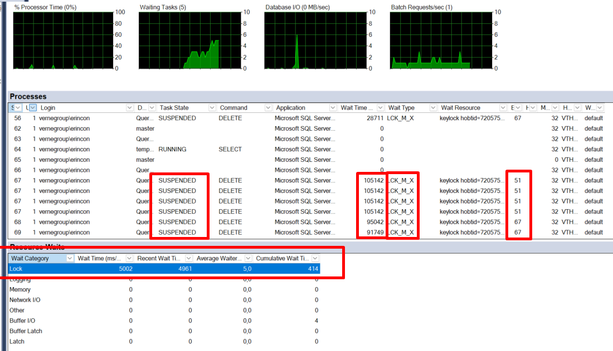

- [Introducción](#introducción)
- [Técnica a seguir](#técnica-a-seguir)

# Introducción

TRABAJO EN PROGRESO. VUELVE MÁS ADELANTE 😉

# Técnica a seguir

Ahora no vamos a explicar  si el problema raiz que tiene el servidor es debido a bloqueos. Partimos de la base de que el problema es de bloqueos. Naturalmente, si en el monitor de procesos de SQL Server ves muchos procesos en estado SUSPENDED, y los WAIT_STATS te dicen que hay mucha latencia por bloqueos (LOCKS), es obvio donde hay que investigar:

- Resource waits:
  - wait category = LOCK.
  - wait time = 5000 ms.
- Processes:
  - task state = SUSPENDED.
  - Wait time = muchos segundos.
  - Wait type = LCK_M_X (bloqueo exclusivo para modificar/borrar).
  - Command = DELETE.

)

Grosso modo el procedimiente sería este:
- Determinar si el problema apunta a bloqueos. Utilizando Activity monitor, waits_stats, y DMVs ver si la influencia de los eventos de LOCKS es alta.
- Determinar si son bloqueos que van y vienen como norma general. 
- Determinar si son bloqueos 

